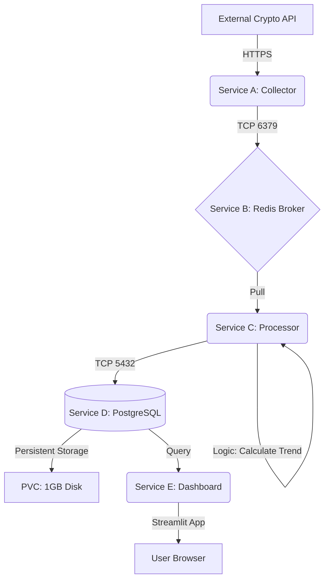
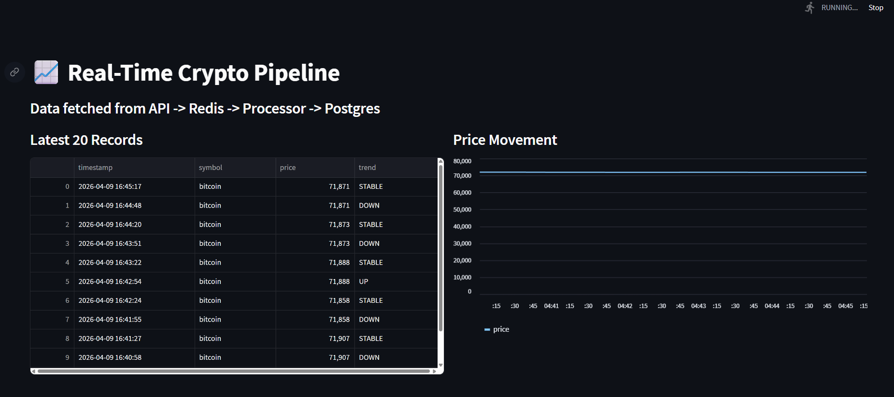
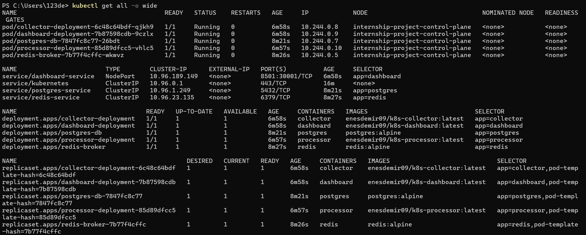
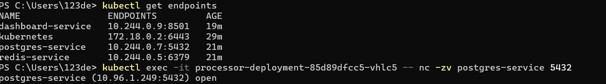
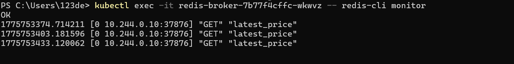
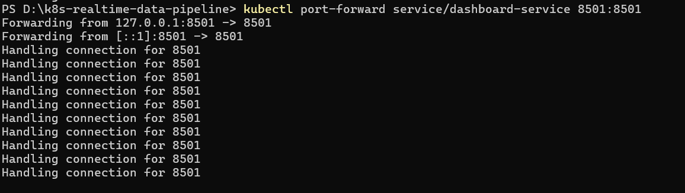

# 📈 Real-Time Crypto Data Pipeline on Kubernetes

A professional, full-stack microservices pipeline designed to fetch, process, and visualize cryptocurrency data in real-time. This project demonstrates proficiency in **Kubernetes orchestration**, **event-driven architecture**, and **automated CI/CD pipelines**.

## 🏗 System Architecture



## 🖼 Evidence of Success

1. The Final Product: Real-Time Dashboard  
The Streamlit frontend visualizes data fetched through the entire pipeline, showing live price movements and trend analysis.  


2. Full Cluster Orchestration  
The system running inside KIND (Kubernetes IN Docker). This shows all 5 pods in Running state with active resource limits.  


3. Data Persistence (PostgreSQL)  
Verification of data integrity. Even if pods restart, the Persistent Volume Claim (PVC) ensures our Bitcoin price history is saved.  


4. Service Discovery & Networking  
Proof that microservices are communicating via internal DNS names and verified ports.  


5. Event-Driven Traffic (Redis Monitor)  
A live look at the "Handshake" between services as data moves through the Redis Broker.  


## 🌐 Local Access & Port Forwarding

To access the internal dashboard from a local browser, a secure tunnel is established using kubectl port-forward. This bridges the cluster's internal network to the host machine.  


## 🚀 The Microservices Team

Service A: The Collector (Python): Ingests real-time data from CoinGecko API.  
Service B: The Broker (Redis): Handles high-speed data buffering.  
Service C: The Processor (Python): Performs trend analysis (UP/DOWN/STABLE).  
Service D: The Database (Postgres): Maintains stateful data with PVC.  
Service E: The Dashboard (Streamlit): User-facing analytical interface.  

## 🛠 Tech Stack & DevOps Features

Orchestration: Kubernetes (KIND)  
CI/CD: GitHub Actions (Automated Docker builds & E2E Smoke Tests).  
Resource Management: Implemented Resource Quotas (CPU/Memory limits) to ensure stability on low-resource hosts (8GB RAM).  
Infrastructure as Code: Declarative YAML manifests for all deployments and services.  

## 🚦 How to Run

Start Cluster:  
```
.\kind.exe create cluster --name project
```

Load Images:  
```
.\kind.exe load docker-image enesdemir09/k8s-collector:latest --name project
```
(repeat for all images)

Deploy:  
```
kubectl apply -f k8s/redis/
kubectl apply -f k8s/postgres/
kubectl apply -f k8s/deployments/
```

View Dashboard:  
```powershell
kubectl port-forward service/dashboard-service 8501:8501
```

Visit http://localhost:8501 in your browser.